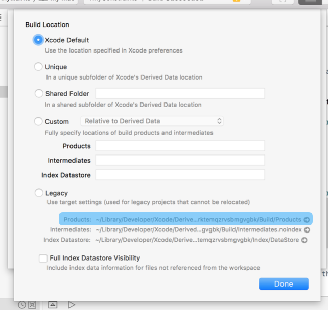
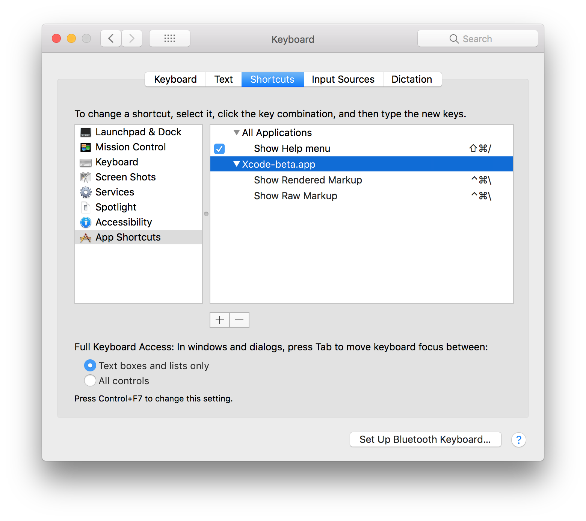

# Creating an interactive readme in playgrounds
Most of this tutorial is based on the WWDC talk [Getting the Most out of Playgrounds in Xcode](https://developer.apple.com/videos/play/wwdc2018/402/). So if you want to know more I recommend looking at it.

## Basic playground introduction

### Where is what and what is where again?
First open a new Playground in XCode 10. Now there are two ways in which you can run the playground code. 
1.  Down at the left to run the enitre playground
2. Or you can use the play button on the lines to execute step by step
Pro-tip: You can also use the shortcut `Shift+Return` after you wrote a line of code to execute it.


By selecting the box you can show the result inline, so you can see the changes you make. When using the new play button, you can add a line that changes your view and only run that line to be able to see the quickest results!


### The live view
If you want to see the result of Views or ViewControllers you can set the current liveView to your view or viewController:
`PlaygroundPage.current.liveView = ViewController`
Dont' forget to `Import PlaygroundSupport` when you do this.

Show the assistant editor to make your live view visible:


Pro-tip: When you lose your live view you can reselect it in this drop down menu by choosing Live View instead of Manual:


### Files
When you show the navigator you can add files to your playground:


Add Swift files to the `Sources` folder. They are automatically imported when visible, but don't forget to make the classes or extensions public, since sources are compiled as separate modules. 


Then you can use the extension in your playground code:


Pro-tip. When debugging these code files breakpoints don’t get hit, so debug them by either using print statements, or just add the code to your playground page to make full use of inspection and when you are happy with it move them to a separate code file.

Add images or other non-code files to the `Resources` folder:


## Creating the README

### Adding playground to a framework

When you want to add a playground to a framework, open the `.xcodeproj` file of the framework and add a new playground by going File > New > Playground.

Remember to always open the  `.xcodeproj`  file and not just the `.playground` file, otherwise it won’t be able to access the framework.

**Don't forget to build the framework before you play your playground!**

Still having trouble? Here are some other tips:
- Sometimes Playgrounds can be a bit buggy, so building the framework again and playing the playground again can never hurt. 
- Restarting XCode can also be a good idea in some cases of uncorporation
- Make sure you build your project on the latest iOS version, and on a Simulator when you have the playground platform set to iOS, since in this case Playgrounds uses the simulator to run on.

- follow these steps to check wether the framework is added correctly:
    * Go to **File** > **Project Settings**
    * Click on **Advanced**
    * Click on **Products** to open the Build products directory
    
    * In there you should find your framework.
- Try to build your project on different simulators, chances are that will make it work.

### Playground description

In swift 4.1 `CustomPlaygroundDisplayConvertible` was introduced, this replaces `PlaygroundQuickLook` but instead of the description's type to be limited to be wrapped in PlaygroundQuickLook cases, it can now handle descriptions of `Any` type. For more info in this you read the [Proposal](https://github.com/apple/swift-evolution/blob/master/proposals/0198-playground-quicklook-api-revamp.md)

Implement `playgroundDescription` from the `CustomPlaygroundDisplayConvertible` protocol as an extension to the entity you want to add a custom description to:

```
import UIKit

extension NSObject: CustomPlaygroundDisplayConvertible {
    public var playgroundDescription: Any {
        return "Whatever you want"
    }
}
```
You can do this in your Playground Page or add it as a separate file in your Sources folder.

Pro-tip: If you add a separate file, don't forget to build again!

### Markdown

For the possibilities of markdown in Playgrounds check [this](https://developer.apple.com/library/archive/documentation/Xcode/Reference/xcode_markup_formatting_ref/index.html) out

Simply tick the render documentation box in the Inspector and the markdown is displayed:


You can also add a shortcut for this toggle: by going into **Xcode** > **Preferences** > **Key Bindings**, then search for **Show Rendered Markup**.


There are many possibilities, adding links, notes and even images and videos. Which can be very helpful in an educational playground.

### Playground Pages

To be able to add more info for your users without cluttering the playground, you can add multiple playground pages:


When you add a new Playground Page the page you had before will automatically get it’s own sub page as well. And the links to the previous page are also automatically added:


Each playground page will have it’s own resources and sources folder. This can be quite convenient when creating a customPlaygroundDescription for the same entity that you want to be different per playground page.

---

Now you are ready to start writing your own interactive readme, if you yourself made any frameworks i would suggest to write a readme for one of those. Otherwise I would suggest to write one for your favourite framework, like I did. 

As an example here's the playground I made for the TinyConstraints the one I showed in the presentation:
- [TinyConstraints Playground](https://github.com/marijnschilling/TinyConstraints)

No inspiration? Here are some suggestions:
- [🕰 Time](https://github.com/dreymonde/Time?utm_source=mybridge&utm_medium=blog&utm_campaign=read_more) I would reckon a playground description to the enitities introduced in this library could make it even easier to understand.
- [Hue](https://github.com/hyperoslo/Hue) Hue is the all-in-one coloring utility that you'll ever need. This is very likely to become a colorful project.
- [Alamofire](https://github.com/Alamofire/Alamofire) Make it easier for people to get on board with Elegant HTTP Networking in Swift.
- [Cheers](https://github.com/hyperoslo/Cheers) 🎊 Fancy confetti effects in Swift, if you are looking for a cheerful project.
- [TaskQueue](https://github.com/icanzilb/TaskQueue) Nice challenge to make a playground description for something abstract like a task queue.
- [CryptoSwift](https://github.com/krzyzanowskim/CryptoSwift) Encrypt and decrypt in a playground

What about getting some inspiration from frameworks that alaready have excellent playground readme's?
- [RxSwift](https://github.com/ReactiveX/RxSwift/blob/master/Documentation/GettingStarted.md#playgrounds) 
- [AudioKit](https://github.com/audiokit/AudioKit) 

As an example here's the playground I made for the TinyConstraints the one I showed in the presentation:
- [TinyConstraints Playground](https://github.com/marijnschilling/TinyConstraints)
